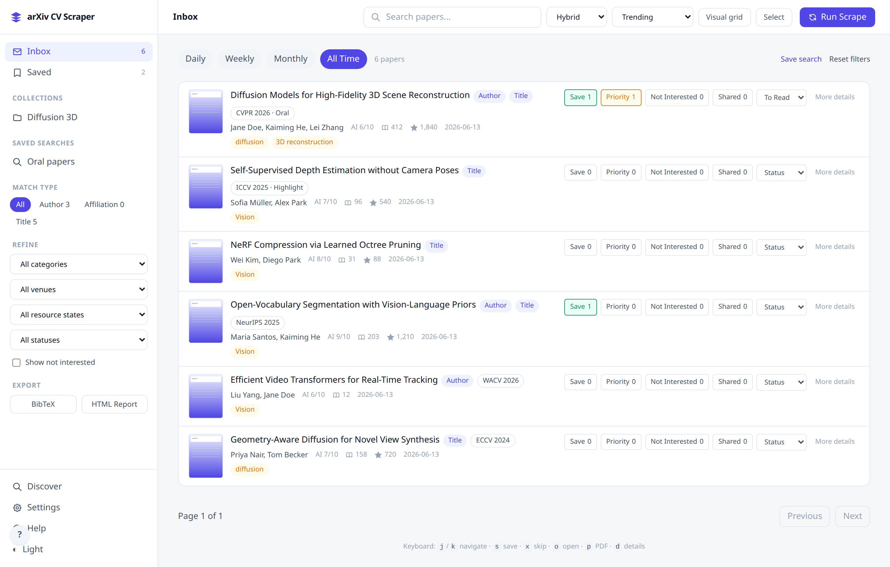

# ArXiv CV Scraper

**Your personal "daily papers" feed for computer vision research.**

Stop drowning in the arXiv firehose. This tool matches papers against authors, labs, and topics you care about, ranks them, and shows you what's worth reading — in a clean local web dashboard.




---

## Quick Start

```bash
git clone https://github.com/rafico/cv_arxiv-scraper.git
cd cv_arxiv-scraper
python3 -m venv .venv
source .venv/bin/activate
python -m pip install --upgrade pip
python -m pip install -e .
cp config.example.yaml config.yaml
python run.py --debug
```

Open **http://127.0.0.1:5000**, click **Run Scrape**, and you're done.

If you skip the copy step, the app will run from `config.example.yaml` defaults and create `instance/config.yaml` only after your first saved change.

---

## Tell it what you care about

Copy `config.example.yaml` to `config.yaml`, then go to **Settings > Research Setup** in the web UI or edit the file directly:

```yaml
whitelists:
  titles:
    - "Few Shot"
    - "Remote Sensing"
  affiliations:
    - "Stanford"
    - "DeepMind"
  authors:
    - "Fei-Fei"
    - "Yann LeCun"
```

---

## Features

**Finding papers**
- Scrapes arXiv daily (or on demand) and matches against your interests
- Hybrid search — keyword, semantic (SPECTER2), or combined
- Historical sync — backfill papers from any date range
- Multiple feed sources — monitor categories beyond cs.CV

**Smart ranking**
- Personalized scoring based on authors, labs, topics, recency, citations, and your feedback
- Ranking explanations show *why* each paper was surfaced
- AI relevance scoring (optional, requires LLM setup)

**TL;DR summaries**
- Every paper card shows a short summary below the title and authors
- Without LLM: extractive summary from the abstract (no API needed)
- With LLM enabled: AI-generated plain-language TL;DR describing what the paper does and why it matters
- Configurable number of visible lines via Settings (default: 3)

**Organization**
- Save, skip, prioritize, or share papers to train future rankings
- Collections, custom tags, notes, and reading status tracking
- Saved searches with custom filter criteria

**Export & sync**
- BibTeX export (single paper or bulk)
- Mendeley and Zotero sync
- HTML report export
- Daily email digest via Gmail

**Enrichment**
- Citation counts from Semantic Scholar and OpenAlex
- Topic classifications and open-access status from OpenAlex
- PDF thumbnails and related-paper recommendations
- Corpus analytics — topic clusters and emerging trends

---

## CLI Commands

After `pip install -e .`:

| Command | What it does |
|---|---|
| `cv-arxiv-scrape` | One-shot scrape, prints matches to terminal |
| `cv-arxiv-digest` | Send email digest (`--dry-run`, `--send-only`) |
| `cv-arxiv-sync` | Historical sync (`--from`, `--to`, `--category`) |
| `cv-arxiv-backfill` | Enrichment backfills (`embeddings`, `citations`, `openalex`, `thumbnails`, `all`) |

Standalone scripts (`python scrape_cli.py`, `python export_cli.py`, etc.) also work without installing once the environment is active.

---

## Email Digest Setup

1. Create a Google Cloud OAuth client with the Gmail API enabled
2. Upload credentials in **Settings** (or save as `credentials.json`)
3. Run `python gmail_auth_setup.py` (or complete setup in Settings)
4. Set your recipient in `config.yaml` under `email.recipient`
5. Test with `cv-arxiv-digest --dry-run`

Only the `gmail.send` scope is requested — the app cannot read your emails.

---

## API

Full REST API at `/api/`. Key endpoints:

| Area | Endpoints |
|---|---|
| Scraping | `POST /api/scrape`, `GET /api/scrape/stream` |
| Search | `GET /api/search?q=...&mode=hybrid` |
| Papers | `/api/papers/<id>/feedback`, `explain`, `notes`, `tags`, `bibtex` |
| Collections | `GET/POST /api/collections`, manage papers in collections |
| Saved searches | `GET/POST /api/saved-searches`, `POST .../run` |
| Corpus | `/api/corpus/clusters`, `emerging`, `neighbors` |
| Export | `GET /api/export`, `GET /api/export/bibtex` |
| Feed sources | `GET/POST /api/feed-sources` |

See the in-app help at `/help` for full documentation.

---

## Testing

```bash
python -m pip install -e ".[dev]"
python -m pytest tests/ -v
```

---

## License

[MIT](LICENSE)
