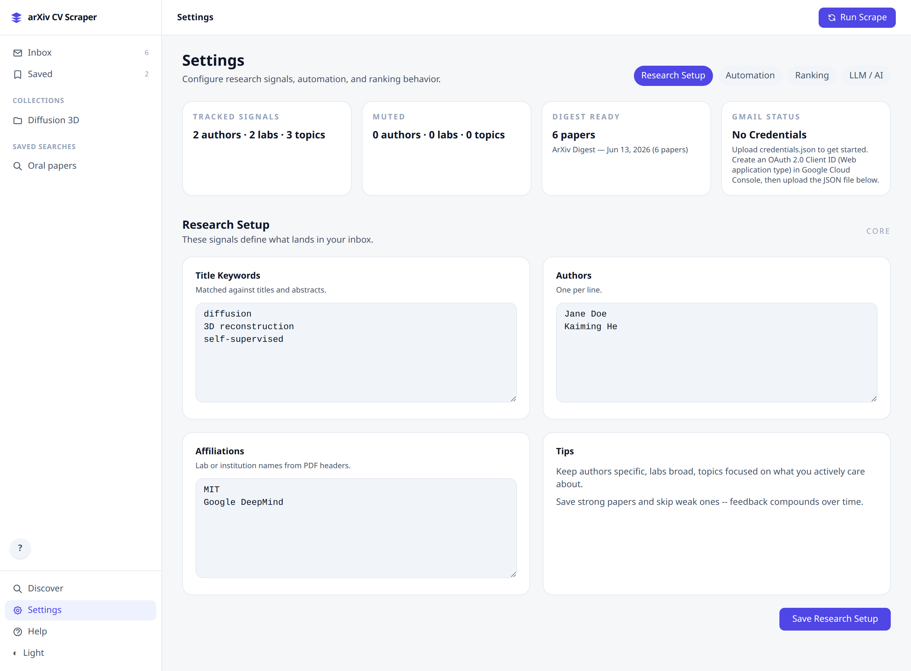
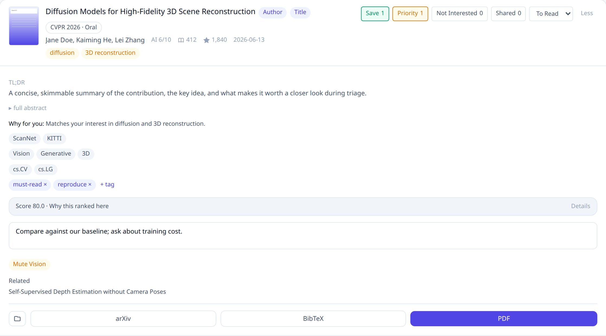
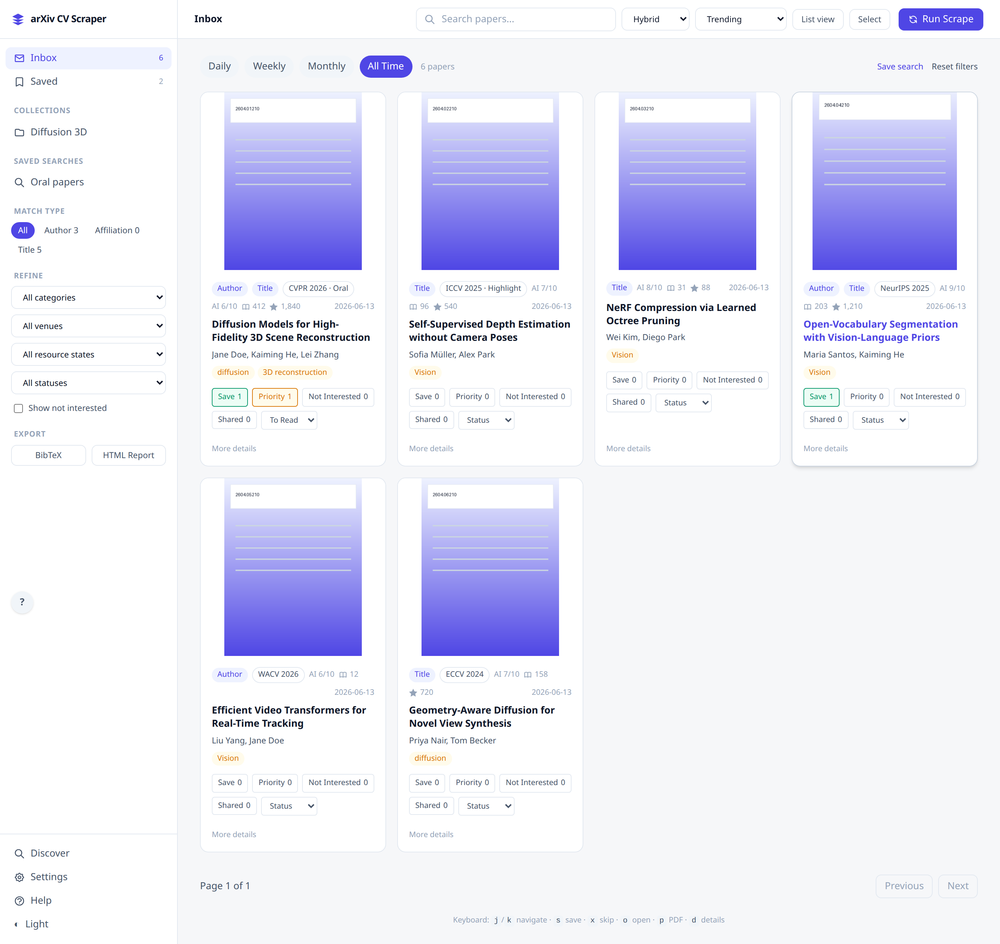

# ArXiv CV Scraper

**Your personal daily-papers feed for computer vision research.**


Every morning arXiv drops another wall of papers, and somewhere in it are the three
that actually matter to you. ArXiv CV Scraper reads the firehose so you don't have to:
tell it the authors, labs, and topics you care about, and it scrapes, ranks, and
*explains* the day's papers in a clean dashboard that runs entirely on your own machine.
No account, no cloud, no inbox of 200 PDFs to feel guilty about.


---

<details>
<summary>📋 <b>Table of contents</b></summary>

- [⚡ Quick Start](#-quick-start)
- [🎯 Tell it what you care about](#-tell-it-what-you-care-about)
- [✨ Why it's different](#-why-its-different)
- [🔍 Inside a paper](#-inside-a-paper)
- [🔀 Two ways to triage](#-two-ways-to-triage)
- [🧩 Features](#-features)
- [💻 CLI commands](#-cli-commands)
- [🔌 API](#-api)
- [🔒 Private by design](#-private-by-design)
- [📦 Optional integrations](#-optional-integrations)
- [🐳 Run with Docker](#-run-with-docker)
- [🧰 Troubleshooting](#-troubleshooting)
- [🔧 Development](#-development)
- [🧱 Tech stack](#-tech-stack)
- [📄 License](#-license)

</details>

---

## ⚡ Quick Start

```bash
git clone https://github.com/rafico/cv_arxiv-scraper.git
cd cv_arxiv-scraper
python3 -m venv .venv
source .venv/bin/activate          # Windows: .venv\Scripts\activate
python -m pip install --upgrade pip
python -m pip install -e .
cp config.example.yaml config.yaml
python run.py --debug
```

Open **http://127.0.0.1:5000** and click **Run Scrape** (top bar). The first run takes
~30–60s — it fetches and ranks today's arXiv feed, so an empty Inbox *before* you scrape
is normal. Matched papers then land in the Inbox, ranked by score.

If you skip the copy step, the app runs from `config.example.yaml` defaults and only
creates `instance/config.yaml` after your first saved change. No auth, localhost-only by
design (see [Private by design](#-private-by-design)).

---

## 🎯 Tell it what you care about

It works in three moves:

1. **Tell it your interests** — authors, labs/affiliations, and title keywords. Set them in
   **Settings → Research Setup** or edit `config.yaml` directly.
2. **It scrapes and ranks** — click **Run Scrape** (or schedule it / use the CLI). The app
   pulls the day's arXiv CV feed, enriches it, and scores every paper against *your*
   interests.
3. **You triage in seconds** — matched papers arrive in the Inbox ranked by score. Save,
   skip, or prioritize with a single keystroke — and every action teaches it what to surface
   next time.

```yaml
whitelists:
  titles:
    - "Few Shot"
    - "Remote Sensing"
  affiliations:
    - "Stanford"
    - "DeepMind"
  authors:
    - "Fei-Fei"
    - "Yann LeCun"
```



---

## ✨ Why it's different

**🧠 It learns your taste, not just your keywords.**
Start with simple author / lab / topic whitelists. After you save ~5 papers, it builds a
learned interest profile (embedding centroids in SPECTER2 space) and starts ranking new work
against what you've *actually* liked — not just literal keyword hits.

**🔬 Every ranking shows its work.**
Expand any paper for **"Score 80.0 · Why this ranked here"** — a breakdown over authors,
labs, topics, recency (14-day half-life by default), citations, and your feedback. The
ranking is never a black box.

**🔍 Hybrid keyword + semantic search.**
Search by exact terms, by meaning (SPECTER2 + FAISS), or both combined — so you can find the
paper you half-remember even when you don't have its words.

**🔒 Private and offline-first.**
Everything runs on localhost with no account. The core — scraping, ranking, semantic search,
and an extractive TL;DR — works with *zero* external APIs. Enrichment and AI features are all
optional and degrade gracefully when off.

---

## 🔍 Inside a paper

Expand any paper (**More details**, or press `d`) to see why it's worth your time — without
opening the PDF:

- **A TL;DR for every paper — no LLM required.** By default you get an extractive summary
  pulled straight from the abstract (no API, no model). Plug in an optional local Ollama or
  hosted OpenRouter model and it upgrades to a plain-language AI TL;DR plus structured
  insights (tasks, datasets, method, *why it matched you*).
- **The full ranking explanation** — the score breakdown described above.
- **Everything to act on it** — tags, notes, related papers, and one-click arXiv / BibTeX /
  PDF links.



---

## 🔀 Two ways to triage

- **Keyboard Inbox** (default) — a dense, fast triage list. Save with `s`, skip with `x`,
  expand a row with `d`, and move with `j` / `k`. Clear a day's feed without touching the
  mouse.
- **Visual grid** — browse papers by their first-page teaser figure when you'd rather skim by
  eye than by title.



> Prefer the older look? A **Classic UI** link at the bottom of the sidebar switches the whole
> app back to the pre-redesign interface; the choice is remembered per browser.

---

## 🧩 Features

| Area | What you get |
|---|---|
| **Finding papers** | Daily/on-demand arXiv scrape with interest matching · hybrid search (keyword · semantic · combined) · historical backfill of any date range · monitor extra arXiv categories beyond cs.CV |
| **Smart ranking** | Personalized multi-factor score (authors, labs, topics, recency, citations, your feedback) · learned interest profile · per-paper "why it ranked" explanations · optional AI relevance scoring |
| **Summaries** | Extractive TL;DR with no API needed · optional AI TL;DR + structured insights when an LLM is enabled |
| **Organization** | Save / skip / prioritize / share to train rankings · collections · custom tags · notes · reading status · saved searches |
| **Export & sync** | BibTeX (single or bulk) · Mendeley · Zotero · HTML report · daily Gmail digest |
| **Enrichment** | Citation counts (Semantic Scholar, OpenAlex) · topic classifications & open-access status · GitHub repo stars/license · PDF thumbnails · related-paper recommendations · corpus analytics (clusters & emerging trends) |

---

## 💻 CLI commands

After `pip install -e .`:

| Command | What it does |
|---|---|
| `cv-arxiv-scrape` | One-shot scrape, prints matches to terminal |
| `cv-arxiv-digest` | Send email digest (`--dry-run`, `--send-only`) |
| `cv-arxiv-sync` | Historical sync (`--from`, `--to`, `--category`) |
| `cv-arxiv-backfill` | Enrichment backfills (`embeddings`, `citations`, `openalex`, `thumbnails`, `all`) |

Standalone scripts (`python scrape_cli.py`, `python export_cli.py`, etc.) also work without
installing once the environment is active.

---

## 🔌 API

Full REST API at `/api/`. Key endpoints:

| Area | Endpoints |
|---|---|
| Scraping | `POST /api/scrape`, `GET /api/scrape/stream` |
| Search | `GET /api/search?q=...&mode=hybrid` |
| Papers | `/api/papers/<id>/feedback`, `explain`, `notes`, `tags`, `bibtex` |
| Collections | `GET/POST /api/collections`, manage papers in collections |
| Saved searches | `GET/POST /api/saved-searches`, `POST .../run` |
| Corpus | `/api/corpus/clusters`, `emerging`, `neighbors` |
| Export | `GET /api/export`, `GET /api/export/bibtex` |
| Feed sources | `GET/POST /api/feed-sources` |

See the in-app help at `/help` for full documentation.

---

## 🔒 Private by design

This app has **no authentication** and is built for single-user localhost use. It refuses to
bind to a non-loopback address unless you pass `--expose`, which should only be used behind a
reverse proxy that adds its own auth. Nothing leaves your machine unless you turn on an
optional integration.

---

## 📦 Optional integrations

Everything below is opt-in. The app is fully usable without any of it.

<details>
<summary><b>AI summaries &amp; relevance</b> (Ollama or OpenRouter — off by default)</summary>

LLM features are **off by default** (`llm.enabled: false` in `config.yaml`). With them off you
still get an extractive TL;DR pulled from each abstract — no API or model needed.

To enable AI-generated summaries and relevance scoring, set `llm.enabled: true` and pick a
provider in `config.yaml`:

- **Local Ollama** (no key) — `provider: ollama`, `base_url: http://localhost:11434/v1`.
  Install [Ollama](https://ollama.com/) and pull the model named in `llm.model`.
- **OpenRouter** (hosted) — `provider: openrouter` plus an `OPENROUTER_API_KEY` (see
  [`.env.example`](.env.example); get a key at https://openrouter.ai/keys).

</details>

<details>
<summary><b>Email digest</b> (daily Gmail digest)</summary>

The app works fully without email — this is only for a daily digest to your inbox.

1. In the [Google Cloud Console](https://console.cloud.google.com/), create an OAuth client
   (type **Desktop app**) with the **Gmail API** enabled, and download its `credentials.json`.
2. Upload that file in **Settings**, or save it at the repo root as `credentials.json`.
3. Authorize: run `python gmail_auth_setup.py` (or click through the flow in Settings).
4. Set your recipient in `config.yaml` under `email.recipient`.
5. Test with `cv-arxiv-digest --dry-run`, then send the real thing with `cv-arxiv-digest`.

Only the `gmail.send` scope is requested — the app cannot read your emails.

</details>

<details>
<summary><b>Enrichment credentials</b> (GitHub, OpenAlex)</summary>

Both are optional and the app degrades gracefully without them:

- **GitHub** repo stars/license — set a `GITHUB_TOKEN` (or `github.token` in `config.yaml`) to
  raise the rate limit from 60 to 5000 req/hr. Without it, repo enrichment is just capped
  per run.
- **OpenAlex** citations/topics — set `openalex.email` to a contact address (their polite-pool
  courtesy); it works without one.

</details>

---

## 🐳 Run with Docker

Docker Compose follows the same local-only default by publishing the container as
`127.0.0.1:5000:5000`. Run `cp config.example.yaml config.yaml` first — Compose bind-mounts
that file, so `docker compose up` fails if it doesn't exist. If you intentionally publish it
on a network interface, put it behind an authenticated reverse proxy first.

```bash
cp config.example.yaml config.yaml
docker compose up
```

---

## 🧰 Troubleshooting

- **"Address already in use" / port 5000 busy** — another app holds the port. Run on another
  with `PORT=5001 python run.py --debug`.
- **First scrape feels slow / hangs for ~30s** — importing `faiss`/`sentence-transformers` is
  heavy on first load, and the first scrape fetches PDFs. This is normal; it's faster
  afterward.
- **A few papers log PDF-extraction warnings** — non-fatal. The paper is still ingested; only
  its thumbnail/section extraction is skipped.
- **No papers after a scrape** — your whitelists may not match today's feed. Widen them in
  **Settings → Research Setup** (or `config.yaml`) and scrape again.

---

## 🔧 Development

Want to extend or contribute? See **[CONTRIBUTING.md](CONTRIBUTING.md)** for setup and how the
code is laid out, and [ARCHITECTURE.md](ARCHITECTURE.md) for the deeper design. Run
`make help` for every command.

```bash
python -m pip install -e ".[dev]"
pre-commit install          # enable lint/format/credential hooks on commit
python -m pytest tests/ -v
```

---

## 🧱 Tech stack

Python 3.10+ · Flask 3 · SQLite · sentence-transformers (SPECTER2) + FAISS · pdfplumber.
Single-worker by design — scrape progress streams over SSE with no Redis or extra services.

---

## 📄 License

[MIT](LICENSE)
