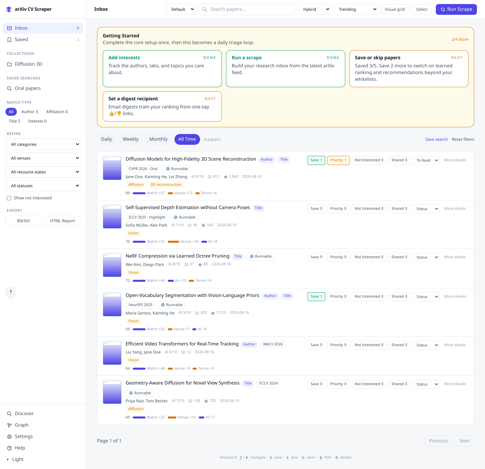
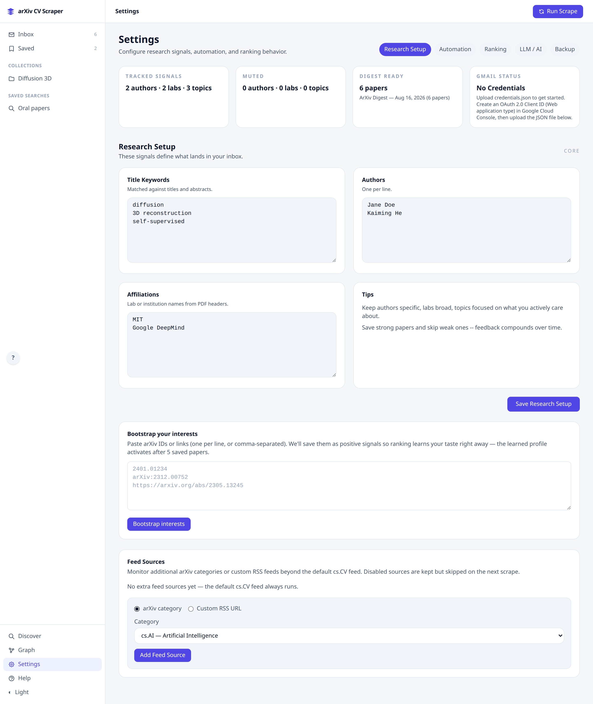
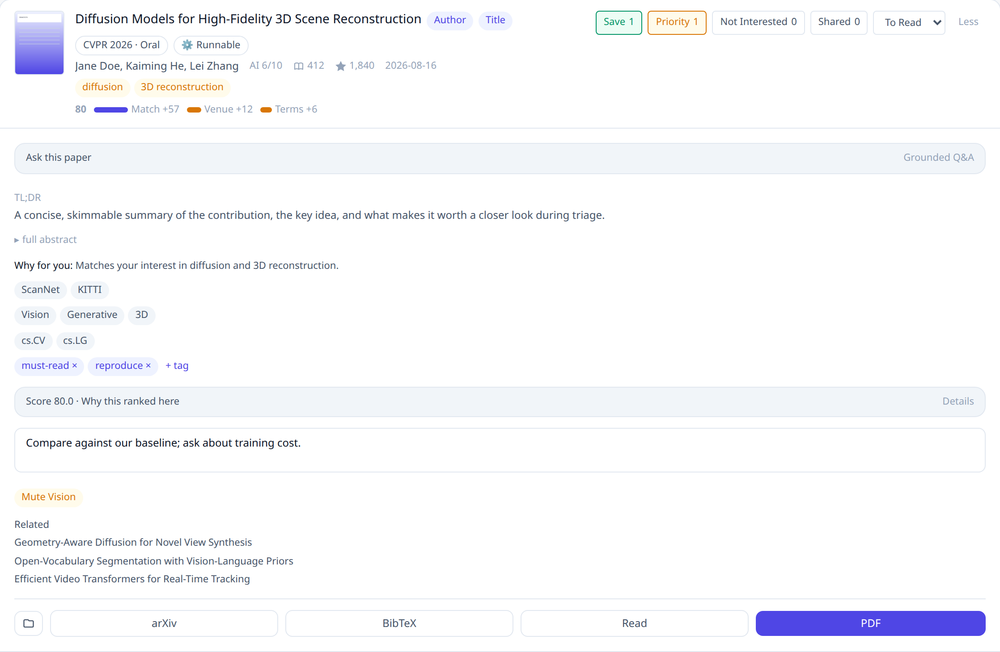
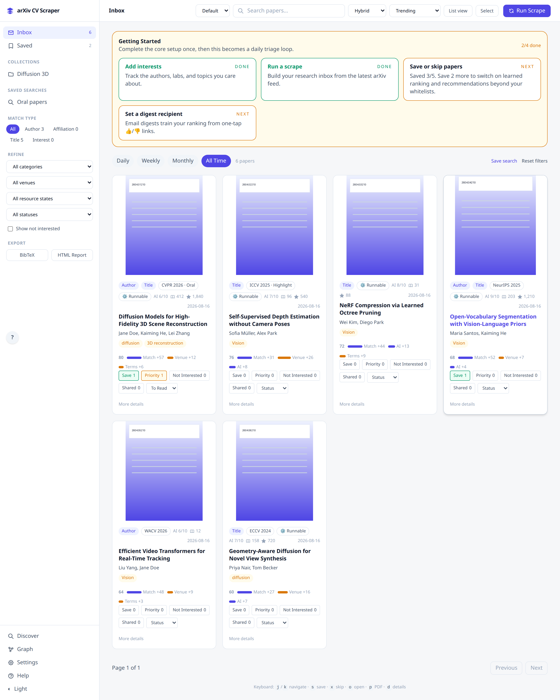

# ArXiv CV Scraper

**Your personal daily-papers feed for computer vision research.**


Every morning arXiv drops another wall of papers, and somewhere in it are the three
that actually matter to you. ArXiv CV Scraper reads the firehose so you don't have to:
tell it the authors, labs, and topics you care about, and it scrapes, ranks, and
*explains* the day's papers in a clean dashboard that runs entirely on your own machine.
No account, no cloud, no inbox of 200 PDFs to feel guilty about.



---

<details>
<summary>📋 <b>Table of contents</b></summary>

- [⚡ Quick Start](#-quick-start)
- [🎯 Tell it what you care about](#-tell-it-what-you-care-about)
- [✨ Why it's different](#-why-its-different)
- [🔍 Inside a paper](#-inside-a-paper)
- [🔀 Two ways to triage](#-two-ways-to-triage)
- [🧩 Features](#-features)
- [💻 CLI commands](#-cli-commands)
- [🔌 API](#-api)
- [🔒 Private by design](#-private-by-design)
- [📦 Optional integrations](#-optional-integrations)
- [🐳 Run with Docker](#-run-with-docker)
- [🧰 Troubleshooting](#-troubleshooting)
- [🔧 Development](#-development)
- [🧱 Tech stack](#-tech-stack)
- [📄 License](#-license)

</details>

---

## ⚡ Quick Start

Pick whichever fits. All three are **localhost-only, single-user, no auth** by design
(see [Private by design](#-private-by-design)).

**Run it with `uvx` (no install):**

```bash
uvx cv-arxiv-scraper serve
# or straight from git:
uvx --from git+https://github.com/rafico/cv_arxiv-scraper cv-arxiv serve
```

`serve` keeps everything (DB, search index, config, secrets) in one **data directory** —
`--data-dir DIR`, else `$CV_ARXIV_DATA_DIR`, else `~/.local/share/cv-arxiv`. A config is
seeded on first run. Loopback-only unless you pass `--expose`.

**Install with `pip`:**

```bash
python3 -m venv .venv && source .venv/bin/activate   # Windows: .venv\Scripts\activate
python -m pip install .            # from a checkout (or `cv-arxiv-scraper` from PyPI)
cv-arxiv serve                     # or: cv-arxiv serve --data-dir ~/papers --port 8000
cv-arxiv --version                 # print the version
```

**Run with Docker Compose** — see [Run with Docker](#-run-with-docker) (with or without a
bundled local LLM).

**Develop from source:**

```bash
git clone https://github.com/rafico/cv_arxiv-scraper.git
cd cv_arxiv-scraper
python3 -m venv .venv && source .venv/bin/activate
python -m pip install -e .
cp config.example.yaml config.yaml
python run.py --debug
```

Open **http://127.0.0.1:5000** and click **Run Scrape** (top bar). The first run takes
~30–60s — it fetches and ranks today's arXiv feed, so an empty Inbox *before* you scrape
is normal. Matched papers then land in the Inbox, ranked by score.

**Health check:** `GET /healthz` returns JSON `{status, version, db_ok, faiss_ok,
paper_count}` — 200 when healthy, 503 when degraded. Handy for uptime probes and the
Docker healthcheck.

---

## 🎯 Tell it what you care about

It works in three moves:

1. **Tell it your interests** — authors, labs/affiliations, and title keywords. Set them in
   **Settings → Research Setup** or edit `config.yaml` directly.
2. **It scrapes and ranks** — click **Run Scrape** (or schedule it / use the CLI). The app
   pulls the day's arXiv CV feed, enriches it, and scores every paper against *your*
   interests.
3. **You triage in seconds** — matched papers arrive in the Inbox ranked by score. Save,
   skip, or prioritize with a single keystroke — and every action teaches it what to surface
   next time.

```yaml
whitelists:
  titles:
    - "Few Shot"
    - "Remote Sensing"
  affiliations:
    - "Stanford"
    - "DeepMind"
  authors:
    - "Fei-Fei"
    - "Yann LeCun"
```



---

## ✨ Why it's different

**🧠 It learns your taste, not just your keywords.**
Start with simple author / lab / topic whitelists. After you save ~5 papers, it builds a
learned interest profile (embedding centroids in SPECTER2 space) and starts ranking new work
against what you've *actually* liked — not just literal keyword hits. Keep your reading in
collections and they become the profile instead: each new paper is scored by how close it
sits to one of them, and the closest are let in without any whitelist hit, named after
their collection.

**🔬 Every ranking shows its work.**
Expand any paper for **"Score 80.0 · Why this ranked here"** — a breakdown over authors,
labs, topics, recency (14-day half-life by default), citations, and your feedback. The
ranking is never a black box.

**🔍 Hybrid keyword + semantic search.**
Search by exact terms, by meaning (SPECTER2 embeddings), or both combined — so you can find the
paper you half-remember even when you don't have its words.

**💬 Ask your own library questions.**
Chat with the papers you've saved (**Discover → Chat with your papers**), or one collection (its sidebar's
**Ask this collection →**): grounded, `[n]`-cited answers when an LLM is enabled, and the most relevant
papers listed, numbered, with the section that matched when it isn't. With nothing saved it searches the
whole library and says so.
Per-paper chat, corpus chat, and citation verification all read the full text captured by
`scraper.extract_sections` (on by default) — with it off, they have nothing to quote.

**🔒 Private and offline-first.**
Everything runs on localhost with no account. The core — scraping, ranking, semantic search,
and an extractive TL;DR — works with *zero* external APIs. Enrichment and AI features are all
optional and degrade gracefully when off.

---

## 🔍 Inside a paper

Expand any paper (**More details**, or press `d`) to see why it's worth your time — without
opening the PDF:

- **A TL;DR for every paper — no LLM required.** By default you get an extractive summary
  pulled straight from the abstract (no API, no model). Plug in an optional local Ollama or
  hosted OpenRouter model and it upgrades to a plain-language AI TL;DR plus structured
  insights (tasks, datasets, method, *why it matched you*).
- **The full ranking explanation** — the score breakdown described above.
- **Everything to act on it** — tags, notes, related papers, and one-click arXiv / BibTeX /
  PDF links.



---

## 🔀 Two ways to triage

- **Keyboard Inbox** (default) — a dense, fast triage list. Save with `s`, skip with `x`,
  expand a row with `d`, and move with `j` / `k`. Clear a day's feed without touching the
  mouse. Inside a collection, screen a literature review with `i` / `m` / `e`
  (include / maybe / exclude).
- **Visual grid** — browse papers by their first-page teaser figure when you'd rather skim by
  eye than by title.



---

## 🧩 Features

| Area | What you get |
|---|---|
| **Finding papers** | Daily/on-demand arXiv scrape with interest matching · hybrid search (keyword · semantic · combined) · historical backfill of any date range · monitor extra arXiv categories beyond cs.CV |
| **Smart ranking** | Personalized multi-factor score (authors, labs, topics, recency, citations, your feedback) · interest profile learned from your collections or your saves · per-paper "why it ranked" explanations + optional inline score-factor bars · optional AI relevance scoring |
| **Chat & cold-start** | Chat with your saved papers or a collection (grounded, cited RAG answers) · seed your profile from a pasted list of arXiv IDs · active-learning prompts surface borderline papers to sharpen ranking |
| **Summaries** | Extractive TL;DR with no API needed · optional AI TL;DR + structured insights when an LLM is enabled |
| **Organization** | Save / skip / prioritize / share to train rankings (until collections become the profile) · collections (create, rename, bulk add) seeded from pasted arXiv ids/URLs/.bib or an arXiv search, grown with prior works (outside papers 2+ members cite), screened include / maybe / exclude for a literature review · custom tags · notes · reading status · saved searches |
| **Citation graph** | Your library as a force-directed network of real citation edges (Semantic Scholar + OpenAlex reference lists) · node size = PageRank influence within your corpus · color by year · collection & year filters |
| **Export & sync** | BibTeX (single, bulk, or per collection; `@misc` preprint, or `@inproceedings`/`@article` once accepted) · per-collection CSV screening spreadsheet · shareable collection bundles (plain JSON — import on another instance without duplicating papers) · Mendeley · Zotero · HTML report · daily Gmail digest · one-click full backup & restore (DB + search index + config) |
| **Enrichment** | Citation counts (Semantic Scholar, OpenAlex) · topic classifications & open-access status · GitHub repo stars/license · PDF thumbnails · related-paper recommendations · corpus analytics (clusters & emerging trends) |

---

## 💻 CLI commands

After `pip install -e .`:

| Command | What it does |
|---|---|
| `cv-arxiv serve` | Launch the web server against one `--data-dir` (also `cv-arxiv --version`) |
| `cv-arxiv-scrape` | One-shot scrape, prints matches to terminal |
| `cv-arxiv-digest` | Send email digest (`--dry-run`, `--send-only`) |
| `cv-arxiv-sync` | Historical sync (`--from`, `--to`, `--category`), or `--query` + `--collection` to import an arXiv search into a collection |
| `cv-arxiv-backfill` | Enrichment backfills (`embeddings`, `citations`, `citation-edges`, `openalex`, `thumbnails`, `all`) |

Standalone scripts (`python scrape_cli.py`, `python export_cli.py`, etc.) also work without
installing once the environment is active.

---

## 🔌 API

Full REST API at `/api/`. Key endpoints:

| Area | Endpoints |
|---|---|
| Scraping | `POST /api/scrape`, `GET /api/scrape/stream` |
| Search | `GET /api/search?q=...&mode=hybrid` |
| Papers | `/api/papers/<id>/feedback`, `explain`, `notes`, `tags`, `bibtex` |
| Collections | `GET/POST /api/collections`, manage papers in collections, `PUT .../papers/<pid>/decision` + `PUT .../decisions` (screening), `GET .../export` + `POST /api/collections/import` bundles, `POST /api/collections/import-ids` (seed from arXiv ids/URLs/.bib), `GET .../table.csv`, `GET .../prior-works` |
| Citation graph | `GET /api/graph?collection=<id>` — nodes with PageRank + citation edges |
| Saved searches | `GET/POST /api/saved-searches`, `POST .../run` |
| Corpus | `/api/corpus/clusters`, `emerging`, `neighbors`, `POST /api/corpus/chat` (optional `collection_id`) |
| Onboarding | `POST /api/onboarding/bootstrap`, `GET /api/onboarding/uncertain` |
| Export | `GET /api/export`, `GET /api/export/bibtex` |
| Backup | `GET /api/backup/export`, `POST /api/backup/import` |
| Feed sources | `GET/POST /api/feed-sources` |
| Health | `GET /healthz` (liveness/readiness JSON, no `/api` prefix) |

See the in-app help at `/help` for full documentation.

---

## 🤖 Use as an MCP server for Claude Desktop

Expose your personalized, enriched, ranked, full-text-indexed corpus to Claude
Desktop (or any [MCP](https://modelcontextprotocol.io) client) as a **backend** —
so the assistant searches, reads, and ranks *your* papers instead of the open web.

Install the optional extra and you get a `cv-arxiv-mcp` command that serves over
stdio against the same data directory as `cv-arxiv serve`:

```bash
pip install '.[mcp]'          # or:  pip install 'cv-arxiv-scraper[mcp]'
```

Add it to `claude_desktop_config.json` (Claude Desktop → Settings → Developer →
Edit Config):

```json
{
  "mcpServers": {
    "cv-arxiv": {
      "command": "cv-arxiv-mcp",
      "env": { "CV_ARXIV_DATA_DIR": "/path/to/cv_arxiv-scraper/instance" }
    }
  }
}
```

Point `CV_ARXIV_DATA_DIR` at the directory that holds your `arxiv_papers.db`,
vector index, and `config.yaml`: a source checkout's absolute `instance/` path (as
above), or `~/.local/share/cv-arxiv` if you run `cv-arxiv serve` with its default
data dir. A path with no DB in it silently starts a fresh, empty corpus.
Restart Claude Desktop and the tools appear:

| Tool | What it does |
|---|---|
| `search_papers` | Hybrid / semantic / keyword search over your corpus |
| `get_paper` | Full metadata + citation/readiness/enrichment summary (by id or arXiv id), your tags, why the feed kept it, and the collections it is in |
| `get_summary` | Stored TL;DR summary and structured LLM insights |
| `top_ranked_today` | Today's top-ranked fresh papers (optional interest-profile lens) |
| `list_collections` | Your collections and their paper counts |
| `ask_paper` | Grounded Q&A over one paper's own text, with section citations |
| `get_collection` | A collection's papers with cite keys matching its Export .bib, plus your notes and screening decisions (paged; excluded papers only with `include_excluded`). Optional filters: `tag` (exact), `decision` (`include` / `maybe` / `exclude` / `unscreened`), `added_since_days` |
| `get_paper_text` | A paper's section table of contents + abstract, then any section's verbatim text (paged) |
| `whats_new` | Papers that arrived in the last N days, are in no collection yet and score close to one: candidates to screen, each with its z, the collection it is closest to (wrong about one time in five) and the nearest paper already in it. Filter with `collection` |
| `set_decision` | Write: a screening decision (`include` / `maybe` / `exclude`) for one paper in a collection, with a required one-line reason. Files the paper if it is not in the collection yet; never overwrites a decision you made |
| `tag_papers` | Write: add one tag to up to 50 papers (add-only; all or nothing if an id is unknown) |
| `add_to_collection` | Write: file a paper into a collection (idempotent). An unknown name is an error unless `create=true` |

Every paper in a list carries your `user_tags` and `has_full_text`, so the
assistant knows which papers it can read in full without asking for each.

The three write tools are meant for sessions you attend. Each write is appended
to `mcp_writes.jsonl` next to the database (time, tool, ids, previous and new
value, reason) before it is committed. A decision or a paper the assistant adds
shows on the collection page with an **Agent** mark and its reason until you
confirm it (click the same decision) or overrule it (click another); the reason
is never returned by a tool. There is no undo tool: undoing is yours, in the web
UI.

Start it with `cv-arxiv-mcp --read-only` (`"args": ["--read-only"]` in the config
above) to register no write tool at all, for example for an unattended run. The
app still starts as usual: its idempotent schema check runs on the database, and
scrape runs that a crash left marked as running are closed. The built-in scrape
scheduler does not run in a read-only server, even when the config enables it.
A running server picks up the papers a later scrape embeds; no restart is needed.

The `mcp` package is an **optional extra**: the core install and web server work
without it, and `cv-arxiv-mcp` prints an install hint and exits non-zero if it is
missing.

---

## 🔒 Private by design

This app has **no authentication** and is built for single-user localhost use. It refuses to
bind to a non-loopback address unless you pass `--expose`, which should only be used behind a
reverse proxy that adds its own auth. Nothing leaves your machine unless you turn on an
optional integration.

---

## 📦 Optional integrations

Everything below is opt-in. The app is fully usable without any of it.

<details>
<summary><b>AI summaries &amp; relevance</b> (Ollama or OpenRouter — off by default)</summary>

LLM features are **off by default** (`llm.enabled: false` in `config.yaml`). With them off you
still get an extractive TL;DR pulled from each abstract — no API or model needed.

To enable AI-generated summaries and relevance scoring, set `llm.enabled: true` and pick a
provider in `config.yaml`:

- **Local Ollama** (no key) — `provider: ollama`, `base_url: http://localhost:11434/v1`.
  Install [Ollama](https://ollama.com/) and pull the model named in `llm.model`.
- **OpenRouter** (hosted) — `provider: openrouter` plus an `OPENROUTER_API_KEY` (see
  [`.env.example`](.env.example); get a key at https://openrouter.ai/keys).

</details>

<details>
<summary><b>Email digest</b> (daily Gmail digest)</summary>

The app works fully without email — this is only for a daily digest to your inbox.

1. In the [Google Cloud Console](https://console.cloud.google.com/), create an OAuth client
   (type **Desktop app**) with the **Gmail API** enabled, and download its `credentials.json`.
2. Upload that file in **Settings**, or save it at the repo root as `credentials.json`.
3. Authorize: run `python gmail_auth_setup.py` (or click through the flow in Settings).
4. Set your recipient in `config.yaml` under `email.recipient`.
5. Test with `cv-arxiv-digest --dry-run`, then send the real thing with `cv-arxiv-digest`.

Only the `gmail.send` scope is requested — the app cannot read your emails.

</details>

<details>
<summary><b>Enrichment credentials</b> (GitHub, OpenAlex)</summary>

Both are optional and the app degrades gracefully without them:

- **GitHub** repo stars/license — set a `GITHUB_TOKEN` (or `github.token` in `config.yaml`) to
  raise the rate limit from 60 to 5000 req/hr. Without it, repo enrichment is just capped
  per run.
- **OpenAlex** citations/topics — set `openalex.email` to a contact address (their polite-pool
  courtesy); it works without one.

</details>

---

## 🐳 Run with Docker

Docker Compose follows the same local-only default by publishing the container as
`127.0.0.1:5000:5000`. Run `cp config.example.yaml config.yaml` first — Compose bind-mounts
that file, so `docker compose up` fails if it doesn't exist. If you intentionally publish it
on a network interface, put it behind an authenticated reverse proxy first.

```bash
cp config.example.yaml config.yaml
docker compose up                       # no AI, just the app on http://127.0.0.1:5000
```

The container's health is the [`/healthz`](#-quick-start) endpoint, so `docker ps` shows
`healthy` once the app is serving.

### With a bundled local LLM (`local-ai` profile)

Want AI summaries and chat without signing up for anything? The `local-ai` profile adds an
[Ollama](https://ollama.com/) sidecar and an AI-enabled app instance already wired to it:

```bash
cp config.example.yaml config.yaml
docker compose --profile local-ai up
```

This starts the plain app on `127.0.0.1:5000` (no AI, as above) **plus** the AI dashboard on
`127.0.0.1:5001`, sharing the same corpus. Ollama runs **CPU-only by default** (slower but
works with zero setup); to use an NVIDIA GPU, install the nvidia-container-toolkit and
uncomment the `deploy` block on the `ollama` service in `docker-compose.yml`. The model
(default `gemma2:2b`) is pulled on first start, so the first AI answer waits for that
download; override it with `OLLAMA_MODEL=... docker compose --profile local-ai up` (and edit
`llm.model` in `config.local-ai.example.yaml` to match). All ports stay loopback-bound.

---

## 🧰 Troubleshooting

- **"Address already in use" / port 5000 busy** — another app holds the port. Run on another
  with `PORT=5001 python run.py --debug`.
- **First scrape feels slow / hangs for ~30s** — importing `sentence-transformers` is
  heavy on first load, and the first scrape fetches PDFs. This is normal; it's faster
  afterward.
- **A few papers log PDF-extraction warnings** — non-fatal. The paper is still ingested; only
  its thumbnail/section extraction is skipped.
- **No papers after a scrape** — your whitelists may not match today's feed. Widen them in
  **Settings → Research Setup** (or `config.yaml`) and scrape again.
- **Logs say arXiv "refused" a request (HTTP 406, or 429)** — arXiv's export API is
  throttling your host, and waiting minutes doesn't clear it. Nothing to fix: the app stops
  asking for 30 minutes and falls back on its own. Scrapes and sync windows use arXiv
  OAI-PMH; id lookups (seed import, bootstrap) ask Semantic Scholar first and OAI-PMH for the
  rest at arXiv's 1 request per 3 seconds, so ids they had no time for are listed as "try
  again in a minute"; `cv-arxiv-sync --query` uses Semantic Scholar search (Computer Science
  only). A `cv-arxiv-sync` window starting more than ~60 days ago fails instead of leaving a
  gap; rerun it once arXiv accepts requests again.

---

## 🔧 Development

Want to extend or contribute? See **[CONTRIBUTING.md](CONTRIBUTING.md)** for setup and how the
code is laid out, and [ARCHITECTURE.md](ARCHITECTURE.md) for the deeper design. Run
`make help` for every command.

```bash
python -m pip install -e ".[dev]"
pre-commit install          # enable lint/format/credential hooks on commit
python -m pytest tests/ -v
```

---

## 🧱 Tech stack

Python 3.10+ · Flask 3 · SQLite · sentence-transformers (SPECTER2, exact NumPy vector search) · pdfplumber.
Single-worker by design — scrape progress streams over SSE with no Redis or extra services.

---

## 📄 License

[MIT](LICENSE)
